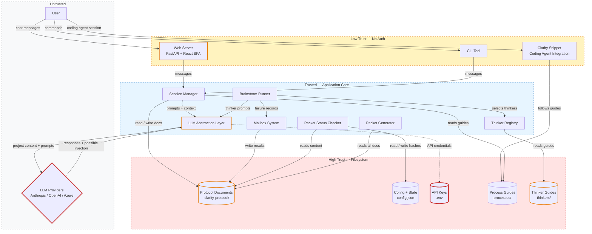
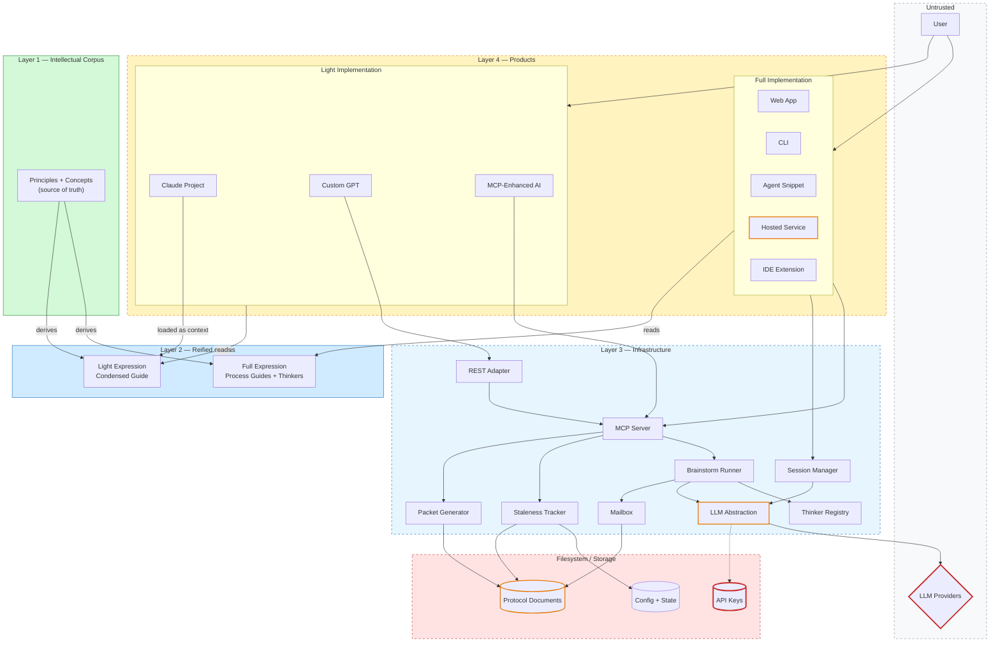

# Architecture

---

## Architecture As Built

### Core Abstractions

**Nouns** — the objects the system manages:

- **Protocol** — the `.clarity-protocol/` directory. Everything the system produces lives here, in version control alongside the code it describes.
- **Document** — a single markdown file in the protocol (`problem.md`, `solution.md`, etc.). Documents have a defined dependency order; the packet status checker tracks them as a graph.
- **Process Guide** — a markdown file in `processes/` that directs how an AI session should proceed. Process guides are the logic of the system; everything else is infrastructure.
- **Session** — one conversation with an LLM, following a process guide.
- **Thinker** — an AI agent running a specific failure-analysis perspective. The general thinker runs first inline; specialist thinkers (security, human factors, adversarial, etc.) run on recommendation for deeper analysis.
- **Mailbox** — an inbox directory where thinker outputs land, consumed by downstream analysis.
- **Packet** — a formatted review document generated from the protocol for stakeholders who don't use the tool.

**Verbs** — what happens to those objects:

- **Clarify** — guided conversation turns rough ideas into testable problem statements and traceable requirements.
- **Brainstorm** — the general thinker runs inline to identify failure modes broadly; specialist thinkers run on demand for deeper analysis. Results are recorded via structured tools.
- **Track** — the packet status checker watches document hashes and surfaces what needs revisiting.
- **Record** — artifacts are persisted to the protocol directory after each meaningful step.
- **Generate** — the packet assembler pulls protocol content into a distributable document.

---

### Architecture Overview

The napkin sketch: a **Session** drives a conversation with an LLM, guided by a **Process Guide**, reading from and writing to **Protocol Documents**. The **Packet Status Checker** monitors that document graph. **Brainstorming** runs a **General Thinker** inline first; it identifies broad failure modes and recommends which **Specialist Thinkers** to run for deeper analysis. When specialists run, their results land in a **Mailbox** for downstream analysis. A **Web UI** and **CLI** are both thin entry points into the same session infrastructure. A lightweight **Clarity Snippet** inserted into the project's agent config file (CLAUDE.md or AGENTS.md) makes coding agents follow the process guides directly.

```
User ──► Entry Point ──► Session ──► LLM Provider
         (Web/CLI/        │  ▲         │
          Snippet)    reads│  │responses│
                     guides│  └─────────┘
                          │
                          ▼
                     .clarity-protocol/
                          │
                     ┌────┴────────┐
                Packet Status   Brainstorm
                Checker         Runner
                     │          ├── General Thinker (inline)
                     │          │     recommends ──►
                     │          ├── Specialist A ──► LLM
                     │          └── Specialist B ──► LLM
                     │                  │
                     └────── both ──────► Mailbox ──► Analysis Session
```

---

### Components

#### Session (`session.py`)
Wraps a `ChatBackend` with a project context and optional transcript logging. The session is the unit of user interaction — one conversation, one process guide, one transcript. The web UI, CLI, and coding agent integration all create and manage sessions; none has direct LLM access.

#### Process Guides (`processes/*.md`)
Markdown files that direct how a session proceeds: what to ask, when to write files, which Python infrastructure to invoke. Process guides are LLM-readable and human-readable — they are the logic, not configuration. Changing how the system behaves means editing these files.

#### Packet Status Checker (`packet_status.py`)
Maintains SHA-256 hashes of document content in `config.json`. On each session start, it walks the dependency graph and classifies each document as current, stale, empty, or missing. It also recommends the next process to run based on a topological graph walk. Documents are recorded as current via an explicit `--record` call after a successful process step.

**Dependency graph (encoded in `WALK_ORDER`):**
```
problem → stakeholders → requirements → open-questions
                                             ↓
                                          solution
                                         ↙       ↘
                               failures          summary
                                    ↓
                               architecture
```
The failures → architecture edge is intentionally bidirectional by convention: failures inform architecture, and architecture changes may surface new failures. The checker resolves this by always processing failures before architecture in the walk order.

#### Brainstorm Runner (`brainstorm_runner.py`)
Manages the failure brainstorming flow. The general thinker runs first inline — a broad, lean perspective that identifies failure modes across the system and recommends which specialist thinkers to invoke for deeper analysis. When specialists run, each uses `record_failure` and `record_suggestion` tools to deposit results in the mailbox. The general-thinker-first approach is faster, cheaper, and produces more focused specialist analysis than running all thinkers in parallel.

Sequential mode is available for specialists: later thinkers see the titles of failures already found, reducing redundancy via cross-pollination.

#### Thinker Registry (`thinker_registry.py`)
Discovers thinker guides in `thinkers/` by filename, parses YAML frontmatter for metadata (prerequisites, modes, tags, description), checks prerequisites against the protocol directory, and filters by config whitelist/blacklist. Adding a new thinker requires only one file.

#### Mailbox System (`mailbox.py`)
Provides safe concurrent-write semantics: each response is one file; auto-incrementing timestamp-counter naming handles concurrent writers without locks. Consumers are reentrant — they can process partial state and mark items archived incrementally. Lock files track in-progress thinkers and expose expiry so stalled operations can be detected.

#### LLM Abstraction Layer (`llm/`)
Two-tier design:
- **`LLMClient`** (low level): wraps a single provider's API, normalizes to `LLMResponse` with typed `TextBlock` and `ToolUseBlock` content. Async-only. Stateless.
- **`ChatBackend`** (high level): conversation-oriented — maintains message history, runs tool-use loops, emits callbacks for cost and tool events. Stateful per session. `ClientChatBackend` is the generic implementation; `SdkChatBackend` wraps the Claude Agent SDK directly for IDE integration.

Provider implementations live in `llm/impl/` with lazy imports. A tier system (`default`, `deep`, `fast`) maps to models per provider and per process, configurable via environment variables.

**Tier system:** Processes have different quality/cost tradeoffs: `problem-clarification` and `architecture-design` use `deep` (higher capability); `failure-analysis` uses `default`; routing uses `fast`. Tiers map to concrete models per provider and are overridable, so teams can tune cost without changing process logic.

#### Packet Generator (`packet/`)
Composite of typed `ContentSource` objects, each knowing how to read one part of the protocol. Sources are assembled into canonical sections (Intro → Solution → Failures → Decisions → Notes) and rendered via a registered format function (markdown or DOCX). Both content sources and renderers are extensible without modifying core logic.

#### Setup Infrastructure (`setup/`)
Three components manage installation and ongoing health:

- **Installer** (`installer.py`) — runs the full install sequence (preflight checks, venv, pip, web build, snippet insertion). Stdlib-only at the top level so it can run before pip install; submodules like `snippet` are imported lazily after dependencies are available.
- **Snippet** (`snippet.py` + `snippet.md`) — a ~15-line markdown snippet inserted into the project's agent config file (CLAUDE.md or AGENTS.md) with `<!-- clarity-begin -->` / `<!-- clarity-end -->` delimiters for idempotent updates. The snippet has two behavioral modes: *thinking mode* (invoke full clarity processes) and *maintenance mode* (update protocol documents as a TODO after implementation work). Target file auto-detected; `{{PROCESSES_DIR}}` placeholder substituted at insertion time.
- **Doctor** (`doctor.py`) — validates installation health (Python version, dependencies, protocol directory, snippet presence) and offers auto-fix for common issues.

#### Web Backend (`web/app.py` + `session_manager.py`)
FastAPI serves the React SPA and a WebSocket endpoint for chat. A `WebSessionAdapter` bridges the sync `ClaritySession` to async FastAPI via a single-worker thread pool. Tool-use events are queued and streamed to the browser in real time. The current design assumes a single active user (single-player).

#### Web Frontend (`web/`)
React 18 + TypeScript + Vite + Tailwind. Chat history is managed via a reducer in `useChat.tsx`. WebSocket for real-time events; REST for static protocol data (file tree, staleness reports, transcripts). Build output served statically by FastAPI.

---

### Key Data Flows

#### Initialization
```
./clarity . --web
    → init_protocol(): create .clarity-protocol/, write templates, insert snippet
    → create_app(): spin up FastAPI, create WebSessionAdapter
    → WebSessionAdapter.start(): create ChatBackend (provider-specific), open ClaritySession
    → http://localhost:8420
```

#### Conversation (any process)
```
User types message
    → WebSocket → WebSessionAdapter.chat()
    → ClaritySession → ChatBackend.chat()
    → [runs in thread pool] LLMClient.create_message() → LLM Provider
    → Response returned, history updated
    → Session writes any output files to .clarity-protocol/
    → WebSocket streams response + any tool events to browser
```

#### Failure Brainstorming
```
Session runs failure-brainstorming process
    → General thinker runs inline in the conversation
    → Identifies broad failure modes, records via tools
    → Recommends specialist thinkers for deeper analysis
    → User requests deeper analysis ("deeper" command)
    → Specialist thinkers run via brainstorm_runner
        each specialist:
        → LLMClient.arun_tool_loop(system=thinker_guide + project context)
        → LLM calls record_failure / record_suggestion
        → handler writes one .md file to mailbox
        → tool-use callback streams event to WebSocket
    → Mailbox ready for analysis session
```

#### Packet Status Check
```
Session start
    → packet_status.check_packet_status()
        → load config.json (recorded hashes)
        → for each doc in WALK_ORDER:
            compute SHA-256(content), compare with recorded dependency hashes
            classify: current / stale / empty / missing
        → next_action(): topological walk finds first gap
    → format_for_agent(): include in system prompt context
```

---

### Technology Decisions

**Python + FastAPI for backend.** LLM orchestration, file I/O, and the staleness graph live in Python. FastAPI handles the web layer with minimal ceremony.

**React + TypeScript + Vite for frontend.** Standard web stack. Vite's dev proxy for local development; production build served statically by FastAPI.

**Markdown files as the persistence layer.** Human-readable, version-controllable, diffable, LLM-readable. No schema enforcement, but inspectability and portability outweigh that cost.

**SHA-256 content hashes for staleness.** Timestamps are fragile across git operations. Hashes only signal real changes. Trade-off: staleness detected on explicit check, not in real-time.

**Mailbox for thinker output.** One file per result, timestamp-counter naming, no locking. Survives interruption, is visible and debuggable as a directory. Reentrant consumers support incremental analysis.

**Process guides as logic.** Behavior encoded in markdown, not Python. Readable, evaluable, and improvable without running the system. Works with any capable LLM. Cost: not type-checked or tested as code.

**Two-tier LLM abstraction.** `LLMClient` (provider wrapper) separated from `ChatBackend` (conversation management). Conversation logic implemented once, shared across providers. Adding a provider means implementing only the low-level wrapper.

**General-thinker-first brainstorming.** A single broad thinker runs inline first, producing a useful initial analysis quickly and cheaply. It recommends specialists for deeper dives, which run on demand. This replaced the all-thinkers-in-parallel approach, which was slower, more expensive, and produced less focused output.

---

### Cross-Cutting Concerns (As Built)

#### Security
The primary trust boundary is between the application and LLM providers: all protocol content is sent to external APIs. This is by design, but teams should understand what data leaves the system.

Prompt injection is a real risk: adversarial text in project documents becomes part of thinker prompts. No sanitization is provided.

The web interface has no authentication. It binds to `localhost` by default. API keys live in `.env` and must be kept out of version control.

#### Reliability
The packet status checker is resilient to file mutations and git operations — content hashes are recomputed each check. `config.json` is authoritative; deleting it reverts all documents to "unrecorded" without losing the documents.

The mailbox system is resilient to interruption: brainstorming can be stopped and resumed, analysis is reentrant, archives provide an audit trail.

#### Extensibility
Three extension points require no changes to core logic:
- **New thinker**: add a `.md` file to `thinkers/`
- **New LLM provider**: add a file to `llm/impl/`, register in `factory.py`
- **New packet format**: implement a renderer callable, call `register_format()`

#### Observability
Tool-use events stream to the web frontend in real time. Session transcripts written to `clarity-protocol-transcripts/`. The staleness report is included in each session's system prompt. Cost callbacks fire per LLM response.

---

### Risks (As Built)

**Thinker output quality.** Thinkers may produce generic failure modes. Quality depends on the richness of protocol documents and thinker guide quality. No scoring or filtering of low-quality outputs.

**Process guide drift.** Guides are maintained separately from the Python infrastructure they describe. No automated tests verify guide/implementation correspondence.

**Single-player web UI.** One active user assumed. Multi-user requires session isolation.

**LLM provider dependency.** All substantive work requires an external LLM API. No offline or degraded mode.

**config.json as single source of truth.** Can be manually edited to suppress staleness warnings. Low practical risk but a brittleness point.

---

### Threat Model (As Built)

| Threat | Severity | Affected Components | Mitigation |
|--------|----------|---------------------|------------|
| Prompt injection via project documents | High | Protocol Documents, Brainstorm Runner, LLM Providers | Accept as inherent risk; avoid untrusted content in protocol files |
| Data exfiltration to LLM providers | High | LLM Abstraction Layer, LLM Providers | Review what's in protocol docs; use self-hosted LLMs for confidential projects |
| API key exposure | Critical | API Keys (.env), LLM Abstraction Layer | Keep `.env` out of version control; use environment injection |
| Unauthorized web access (no auth) | High | Web Server | Bind to localhost only; add reverse proxy with auth for multi-user |
| Staleness suppression via config.json tampering | Medium | Config + State, Packet Status Checker | Low practical risk; requires deliberate access |
| Malicious custom thinker guide | Medium | Thinker Guides, Thinker Registry, Brainstorm Runner | Don't load custom thinkers from untrusted directories |
| Runaway LLM cost | Medium | LLM Abstraction Layer, Brainstorm Runner | Cost callbacks provide observability; wire to budget enforcer |



---

## Architecture As Envisioned

### The Four-Layer Model

The target architecture separates concerns into four layers, with two implementation paths (full and light) sharing a common foundation. This section describes the architectural implications of the layer model defined in the solution document.

```
┌─────────────────────────────────────────────────────┐
│  Layer 1: Intellectual Corpus                       │
│  Principles, concepts, methodology (markdown files) │
│  Canonical source — not loaded by AI directly        │
└──────────────┬──────────────────────┬───────────────┘
               │                      │
    ┌──────────▼──────────┐ ┌────────▼────────────┐
    │ Layer 2: Full       │ │ Layer 2: Light       │
    │ Process guides,     │ │ Condensed guide(s),  │
    │ thinker guides,     │ │ single-context,      │
    │ protocol format     │ │ no-tool environment  │
    │ (multi-file, tools) │ │                      │
    └──────────┬──────────┘ └────────┬────────────┘
               │                      │
    ┌──────────▼──────────┐          │
    │ Layer 3:            │          │
    │ Infrastructure      │     [no Layer 3]
    │ via MCP / REST      │          │
    └──────────┬──────────┘          │
               │                      │
    ┌──────────▼──────────┐ ┌────────▼────────────┐
    │ Layer 4: Full       │ │ Layer 4: Light       │
    │ Products            │ │ Products             │
    │ (snippet, web,      │ │ (Claude Project,     │
    │  CLI, hosted, IDE)  │ │  custom GPT, etc.)   │
    └─────────────────────┘ └─────────────────────┘
```

### Layer 1: Architectural Implications

Layer 1 is a set of markdown files that capture the principles and concepts of structured thinking. It has no runtime role — no AI session loads it directly. Its architectural significance is as the **source of truth** for both Layer 2 expressions.

The staleness tracking infrastructure (Layer 3) could potentially be extended to track Layer 1 → Layer 2 dependencies, surfacing when a principle has been updated but its corresponding process guide or light guide expression hasn't been. This would treat Layer 1 documents as upstream of both Layer 2 variants in an expanded dependency graph.

### Layer 2: Two Expressions

**Full expression** is the current process guides, thinker guides, and protocol format. Architecturally unchanged from the as-built system. Multiple files, assumes tool access and multi-file context.

**Light expression** is new. Architectural considerations:

- **Context budget.** A single guide (or small set) must fit within the system prompt / project context budget of the host AI tool. This constrains length and requires the guide to encode *principles and key moves* rather than mechanical detail.
- **No file system.** Protocol output is produced as structured text in the conversation. The guide must define a clear output format that the user can recognize, copy, and organize.
- **No state between sessions.** Without infrastructure, the AI has no memory of previous conversations. The guide should encourage the user to paste previous protocol output into the conversation for continuity — but can't enforce it.
- **Graceful feature absence.** The light guide must not reference tools, file operations, or infrastructure capabilities it doesn't have. It should provide conversational alternatives where possible (e.g., "let me think about what might have changed since we last discussed this" in place of staleness tracking).

### Layer 3: MCP as the Portability Interface

The key architectural change from the as-built system: infrastructure exposed via **MCP** rather than invoked directly as Python commands by the process guides.

**What changes:**

The current process guides contain instructions like `python -m clarity_agent.protocol.packet_status . --record goal/problem.md`. These work when the AI has shell access (coding agent, CLI) but not in other contexts. With MCP exposure, the same operations become tool calls that any MCP-capable AI environment can invoke:

| Current (direct invocation) | Target (MCP tool) |
|---|---|
| `python -m clarity_agent.protocol.packet_status .` | `check_staleness()` |
| `python -m clarity_agent.protocol.packet_status . --record goal/problem.md` | `record_document("goal/problem.md")` |
| `python -m clarity_agent.protocol.initialize .` | `initialize_protocol()` |
| Brainstorm runner invoked via session | `run_thinker("general")`, `run_thinker("security")` |
| Manual file writes with guessed paths | `record_failure(title, description, ...)` |
| Packet generation via CLI | `generate_packet(format="docx")` |

**MCP server architecture:**

```
MCP Client (any AI tool)
    │
    ▼
MCP Server (clarity-agent)
    ├── Staleness tools: check_staleness, record_document
    ├── Protocol tools: initialize_protocol, read_document
    ├── Brainstorm tools: run_thinker, record_failure, record_suggestion
    ├── Packet tools: generate_packet
    └── State tools: get_status, list_open_questions
    │
    ▼
.clarity-protocol/ (filesystem)
```

The MCP server wraps the existing Python infrastructure — the same `packet_status.py`, `brainstorm_runner.py`, `mailbox.py` modules — with MCP tool interfaces. No reimplementation of core logic; just a new exposure layer.

**REST adapter:** For platforms that support HTTP tool calls but not MCP (e.g., OpenAI Actions), a thin REST layer wraps the same MCP tools. One implementation of core logic, two exposure protocols.

**Environment compatibility matrix:**

| Environment | Layer 2 | Layer 3 access | Experience |
|---|---|---|---|
| Claude Code / coding agents (via snippet) | Full | Direct (shell) or MCP | Full experience |
| Web app / CLI | Full | Direct | Full experience |
| MCP-capable general AI (claude.ai, etc.) | Light or Full | MCP | Full infrastructure via tools |
| REST-capable general AI (ChatGPT Actions) | Light | REST adapter | Full infrastructure via HTTP |
| Bare conversation (no tools) | Light | None | Conversational only; no persistence |

### Layer 4: Product Architecture

All products share the protocol format as the interoperability point. A user's `.clarity-protocol/` directory (or its equivalent) works with any product.

**Full-implementation products** embed or connect to the Layer 3 infrastructure. Architecture varies by product:

- **Coding agent integration** — a short snippet inserted into the project's agent config file (CLAUDE.md or AGENTS.md) with idempotent delimiters. Zero infrastructure of its own; the coding agent's shell access provides Layer 3 via direct invocation. Migration to MCP tools would let the snippet work with coding agents that support MCP but not shell access.
- **Web app** — runs Layer 3 infrastructure in-process. Could additionally expose it as an MCP server for other tools to connect to.
- **Hosted web service** — runs Layer 3 server-side with multi-tenant isolation. New architectural concerns: user authentication, project isolation, storage backend (filesystem may not be appropriate at scale), and cost management per tenant.
- **IDE integration** — connects to a local MCP server running Layer 3 infrastructure.

**Light-implementation products** distribute Layer 2 (light) and rely on the host AI environment for the conversation:

- **Claude Project** — Layer 2 loaded as project knowledge. No infrastructure, no tools, purely conversational.
- **Custom GPT** — Layer 2 loaded as instructions. Could optionally connect to Layer 3 via Actions (REST adapter).
- **MCP-enhanced general AI** — a hybrid: Layer 2 (light) for the conversational guidance, Layer 3 via MCP for infrastructure. Gets most of the full experience in a general AI context.

---

### Expanded Threat Model (As Envisioned)

The broader product surface introduces new trust boundaries and threats beyond the as-built model:

| Threat | Severity | New in Envisioned | Mitigation |
|--------|----------|-------------------|------------|
| All as-built threats | — | No | As above |
| Multi-tenant data isolation failure (hosted service) | Critical | Yes | Per-tenant storage isolation; authentication and authorization at the service layer |
| MCP tool abuse (unauthorized tool calls) | High | Yes | MCP server should validate caller identity; scope tool permissions per session |
| Light guide prompt injection (guide itself is the attack surface) | Medium | Yes | Light guide loaded as system prompt is harder to inject than user-provided content; but custom/modified light guides could be adversarial |
| Protocol format divergence across products | Medium | Yes | Protocol format specification as a Layer 1 artifact; validation tooling |
| Cost amplification via MCP (automated tool calls at scale) | Medium | Yes | Rate limiting on MCP tools; cost tracking per caller |
| Stale light guide (Layer 1 changes not propagated) | Medium | Yes | Staleness tracking extended to Layer 1 → Layer 2 dependencies |



---

### Quality Architecture (Cross-Cutting)

Three design principles from failure analysis apply across all layers:

**Time to first insight.** The process (Layer 2) must surface a genuine challenge or insight within the first few exchanges. This is a design constraint on process guides and a measurable quality metric.

**Invisible self-critique.** Critique guides (Layer 2) inform the AI's internal standard — what to watch for in its own output. These are not a visible process step; they shape the agent's disposition the way a skilled human partner self-corrects mid-thought.

**Conciseness by design.** The protocol format (Layer 1/2) needs a summary layer in each document type — critical content first, detail on demand. Length guidelines and information-splitting principles are captured in Layer 1 and enforced in both Layer 2 expressions.

These principles carry the same architectural weight as the layer model. See the Quality Architecture section in the solution document for full rationale.

---

### Open Architectural Questions

**How should the hosted service handle storage?** The current architecture assumes filesystem-based storage (`.clarity-protocol/` as a directory). A multi-tenant hosted service may need a different storage backend — but the protocol format must remain the same regardless of how it's stored.

**Should the full process guides be refactored to use MCP tools instead of direct Python invocation?** This would make them portable to any MCP-capable environment, but adds a dependency on an MCP server being available. The current direct-invocation approach works without MCP but is limited to shell-access environments.

**How does the light expression handle the evolving-project case (FR11)?** The full expression can potentially read code and existing documentation. The light expression, in a bare conversation, must rely entirely on the user to describe the existing system. Is this sufficient, or does FR11 effectively require tool access?

**What's the protocol format specification?** The current format is defined implicitly by the process guides and templates. If it's the interoperability point across all products, it may need an explicit specification — possibly as a Layer 1 artifact.
