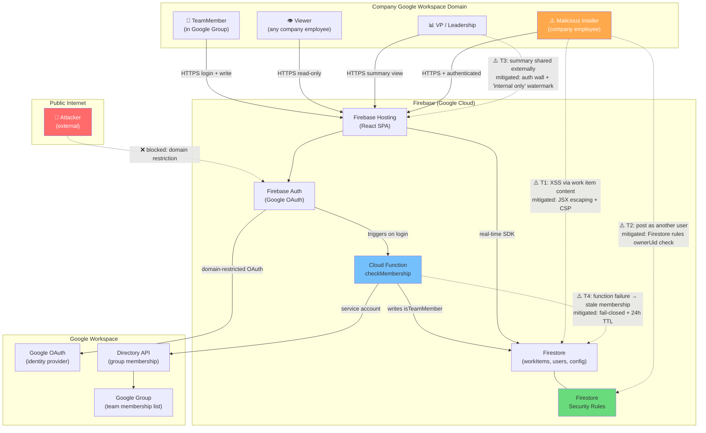

# Architecture: Team Status Dashboard

## Nouns and Verbs

**Nouns the system manages:**

- **WorkItem** — Something a team member is working on. Has an owner (a TeamMember), a name (required), and optional fields: description, status, priority, assignee email, due date, comments. Has createdAt and updatedAt timestamps. Can be archived.
- **TeamMember** — A Google-authenticated user whose email is in the designated Google Group. Can own and manage WorkItems. Has a card on the dashboard.
- **Viewer** — Any Google-authenticated user in the company's Workspace domain. Can read all WorkItems and TeamMember cards. Cannot write.
- **Summary** — A rendered, shareable view of all active WorkItems across all TeamMembers, formatted for copy-paste or link sharing.

**Verbs:**

- **Post / Edit / Delete** — A TeamMember creates, updates, or removes their own WorkItems.
- **View** — Any Viewer (including TeamMembers) reads the dashboard or summary.
- **Check membership** — On login, the system verifies whether the authenticated user belongs to the team's Google Group and records the result.
- **Archive** — Done WorkItems older than 7 days are removed from active display (configurable).

The model is intentionally simple. A TeamMember is just a Viewer who can also write to their own WorkItems. There is no admin role, no approval flow, no hierarchy.

---

## Components

### 1. React SPA (Frontend)

Hosted on Firebase Hosting. A single-page app with two primary routes:

- `/` — **Dashboard**: Grid of TeamMember cards, each showing that person's active WorkItems. Real-time updates via Firestore onSnapshot listeners. TeamMembers see edit controls on their own card; Viewers see read-only cards.
- `/summary` — **Summary page**: Structured list of all active WorkItems organized by TeamMember. Rendered as clean text. Copy button and shareable URL. No modal — this is a first-class route the VP can bookmark.

Both routes require authentication. Unauthenticated users are redirected to a Google sign-in page.

**Tech:** React + Vite. Firebase Auth SDK for login. Firestore SDK for real-time data. No `dangerouslySetInnerHTML` anywhere — all user content rendered via JSX interpolation.

### 2. Firebase Authentication

Google OAuth provider, restricted to the company's Google Workspace domain (`hd` parameter enforced). Any company employee can authenticate; whether they're a TeamMember is determined separately (see Cloud Function below).

Firebase Auth issues a JWT that the Firestore SDK uses to enforce security rules on every read/write.

### 3. Firestore (Database)

Document database with three collections:

**`users/{uid}`**
```
{
  email: string,
  displayName: string,
  photoURL: string,
  isTeamMember: boolean,
  membershipLastChecked: timestamp
}
```
Written by the Cloud Function on login. The frontend reads this document to determine whether to show edit controls.

**`workItems/{itemId}`**
```
{
  ownerUid: string,          // required; immutable after creation
  name: string,              // required
  description: string,       // optional
  status: string,            // optional: "active" | "blocked" | "done"
  priority: string,          // optional: "low" | "medium" | "high"
  assigneeEmail: string,     // optional
  dueDate: timestamp,        // optional
  comments: [                // optional array
    { authorUid, text, createdAt }
  ],
  createdAt: timestamp,
  updatedAt: timestamp,
  archivedAt: timestamp      // set when status=done and age>7d
}
```

**`config/teamGroup`**
```
{ groupEmail: string }
```
Written once at setup. Read by the Cloud Function.

### 4. Cloud Function: `checkMembership`

**Trigger:** Called on user login (via Firebase Auth `onCreate` trigger OR via explicit client call after login).

**Behavior:**
1. Read `config/teamGroup` to get the Google Group email.
2. Call Google Directory API with service account credentials to check whether the logged-in user's email is in the group.
3. Write `{ isTeamMember: bool, membershipLastChecked: now() }` to `users/{uid}`.

**Fail-closed behavior (critical):** If the Cloud Function is unavailable or the Directory API call fails, it writes `isTeamMember: false`. The Firestore security rules treat a missing or false `isTeamMember` as non-member. No one gets write access by default; access must be positively confirmed.

**Membership cache TTL:** The frontend triggers a membership re-check on every login, and the Cloud Function also checks if `membershipLastChecked` is more than 24 hours stale and re-verifies in the background. This limits the window during which a removed member retains write access.

### 5. Firestore Security Rules

Security rules are the second layer of defense after the Cloud Function. They enforce:

```
// WorkItems: any authenticated user can read; only the owner can write
match /workItems/{itemId} {
  allow read: if request.auth != null;
  allow create: if request.auth != null
                && request.auth.uid == request.resource.data.ownerUid
                && isTeamMember();
  allow update, delete: if request.auth != null
                        && request.auth.uid == resource.data.ownerUid
                        && isTeamMember();
}

// Users: any authenticated user can read; only the Cloud Function writes isTeamMember
match /users/{uid} {
  allow read: if request.auth != null;
  allow write: if request.auth.uid == uid
               && !('isTeamMember' in request.resource.data);  
               // isTeamMember can only be set by service account via Admin SDK
}

function isTeamMember() {
  return get(/databases/$(database)/documents/users/$(request.auth.uid))
           .data.isTeamMember == true;
}
```

These rules mean that even if the Cloud Function is compromised or bypassed, a non-member cannot write WorkItems. The two-layer defense (Cloud Function + Firestore rules) means neither layer alone is a single point of failure.

### 6. Google Directory API (External)

The Cloud Function calls this API using a service account with domain-wide delegation, scoped to `https://www.googleapis.com/auth/admin.directory.group.member.readonly`. This is the only API call that crosses outside Firebase infrastructure.

**Setup requirement:** A Google Workspace admin must configure the service account and grant domain-wide delegation. This is a one-time setup and a potential launch blocker — it must be arranged before build starts, as it may require an IT ticket.

---

## Data Flows

### Login & Membership Check

```
User → [Google OAuth] → Firebase Auth → JWT issued
                                     → Cloud Function triggered
                                     → Directory API: is user in group?
                                     → users/{uid}.isTeamMember = true/false
Frontend reads users/{uid} → shows edit controls (TeamMember) or read-only (Viewer)
```

### Work Item Creation

```
TeamMember fills form → Firestore SDK.add(workItems, { ownerUid: me, ... })
Firestore rules check: ownerUid == caller UID AND isTeamMember == true
Other clients' onSnapshot listeners fire → dashboard updates in real time
```

### Summary Generation

```
Viewer/VP navigates to /summary → must be authenticated (redirected if not)
Frontend queries: workItems where status != "done" (or archivedAt == null)
Renders as formatted text: name, status, priority, due date per item, grouped by TeamMember
Copy button → navigator.clipboard.writeText(formattedText)
URL is shareable within company (requires Google login to access)
```

### Archival

```
Client-side or scheduled Cloud Function:
  workItems where status == "done" AND updatedAt < now - 7d
  → set archivedAt = now()
  → filtered from dashboard/summary queries
```

---

## Cross-Cutting Concerns

### Security

**Authentication:** All routes require Firebase Auth. Google OAuth `hd` parameter restricts login to company Workspace domain.

**Authorization:** Two-layer model — Cloud Function sets isTeamMember, Firestore rules enforce it. Fail-closed on any auth system degradation.

**Input handling:** All user content rendered via React JSX interpolation only. No `dangerouslySetInnerHTML`. No markdown/rich-text rendering (comments are plain text). Input length limits: name ≤200 chars, description ≤2000 chars, comment ≤500 chars.

**Content Security Policy:**
```
Content-Security-Policy: 
  default-src 'self';
  script-src 'self' https://apis.google.com https://www.gstatic.com;
  connect-src 'self' https://*.googleapis.com https://*.firebaseio.com;
  frame-src https://accounts.google.com;
```

**Firestore rules tested in CI** via Firebase emulator — include a test that verifies a cross-user write is rejected.

### Reliability

**Fail-closed auth:** Cloud Function failure → write access denied. Never fail open.

**Firebase plan:** Deploy on Blaze (pay-as-you-go) from day one with a low budget alert (e.g., $10/month). Free tier limits are a reliability risk; Blaze with a budget cap provides the same cost behavior but eliminates quota-related outages.

**Uptime monitoring:** HTTP health check against Firebase Hosting URL, with Slack alert on failure.

**Graceful degradation:** If Firestore is unreachable, show a clear "dashboard unavailable" message with a link to the team's Slack channel as fallback.

### Observability

- Firebase console: Firestore reads/writes/errors, Auth events, Function invocations and errors
- Cloud Function logs: membership check results, Directory API errors
- Budget alert: notifies named owner if monthly spend approaches threshold
- Named owner documented in team wiki; service account expiry added to team calendar

### Deployment

- **CI/CD:** GitHub Actions workflow running `firebase deploy --only hosting,functions` on merge to main
- **Environments:** Single Firebase project for MVP. If a staging environment is needed, create a second Firebase project with a separate Google Group for test members.
- **Service account credentials:** Stored as GitHub Actions secret; never committed to source. Rotated annually (calendar reminder set at creation).

---

## Key Decisions Driven by Failure Analysis

| Decision | Rationale |
|----------|-----------|
| Fail-closed auth | Failure 02: auth breakdown should deny writes, not grant them |
| Two-layer auth (Cloud Function + Firestore rules) | Failure 02: neither layer alone should be the single point of failure |
| No `dangerouslySetInnerHTML`, plain-text comments | Failure 08: XSS is low-likelihood only if rendering is strictly escaped |
| CSP headers | Failure 08: defense-in-depth against injected scripts |
| Blaze plan + budget alert from day one | Failure 07: quota-related outages preventable with pay-as-you-go |
| Named owner + ops runbook at launch | Failure 07: ownership gap is the slow-burn reliability failure |
| All routes require auth (including /summary) | Failure 03: summary URL must not be accessible outside the company domain |
| 24-hour membership cache TTL + re-check on login | Failure 02: limits window for stale membership after removal |
| Work type categories in item form | Failure 05: makes maintenance/support/on-call work first-class alongside feature work |
| Launch ritual as first-class deliverable | Failures 01, 04, 05, 06: team norms at launch address four high-severity failures |

---

## Threat Model


