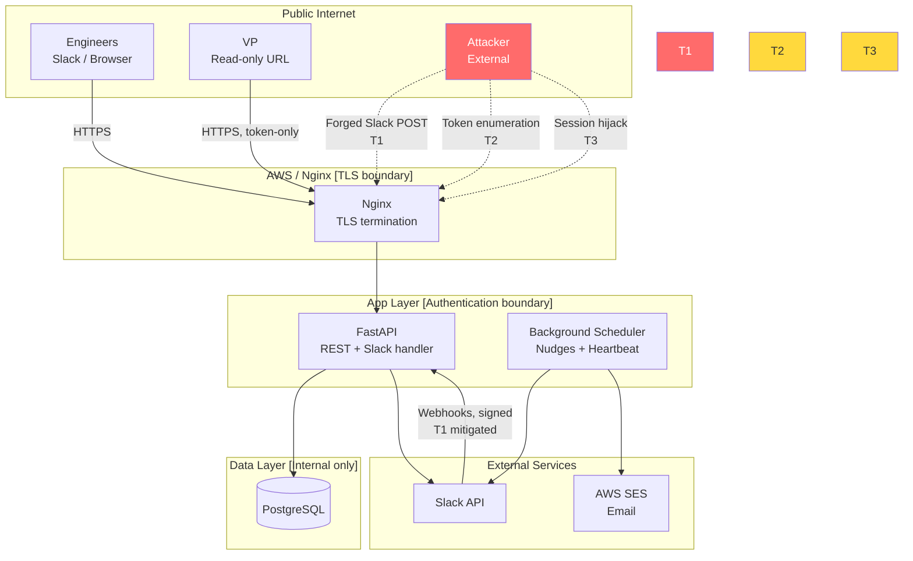

# Architecture

## System Overview

One FastAPI service, one React frontend, one Postgres database, one Slack app. No microservices, no message queues, no event buses. Seven engineers using a coordination tool don't need distributed systems.

```
┌─────────────────────────────────────────────────────────┐
│  Engineers                  VP                          │
│     │                        │                          │
│   Slack app   Browser    Read-only URL                  │
│     │            │            │                         │
└─────┼────────────┼────────────┼─────────────────────────┘
      ↓            ↓            ↓
   ┌──────────────────────────────┐
   │         Nginx (TLS)          │
   └──────────────┬───────────────┘
                  ↓
   ┌──────────────────────────────┐
   │         FastAPI app          │
   │  REST API + Slack handler    │
   │  + background scheduler      │
   └──────┬───────────────────────┘
          │
   ┌──────▼──────┐    ┌────────────┐
   │  PostgreSQL  │    │  AWS SES   │
   │  (existing)  │    │  (email)   │
   └─────────────┘    └────────────┘
```

---

## Nouns and Verbs

**Nouns the system manages:**
- `Engineer` — a team member with a Slack identity and a card
- `Card` — an engineer's current status (one per engineer, always exists)
- `Component` — a curated system area tag, team lead–managed
- `Snapshot` — a shareable read-only view of the team's current state

**Verbs:**
- Engineer `updates` their card (via Slack modal or web form)
- Card `expires` (done-state countdown; staleness after 48h triggers visual warning)
- Scheduler `nudges` engineer (daily Slack DM if card hasn't been updated since previous workday)
- System `detects collision` and notifies when two engineers share a sensitive component tag
- Team lead `reviews` the dashboard, `manages` components and the engineer roster, `regenerates` the snapshot token

---

## Components

### FastAPI Backend

Single application process. Handles three responsibilities:

**1. REST API** (`/api/*`)
- `GET /api/cards` — all cards, authenticated
- `PUT /api/cards/{engineer_id}` — update own card; authorization enforced server-side (engineer can only update their own)
- `GET /api/components` — curated tag list
- `GET /api/engineers` — team roster (team lead only)
- `POST /api/engineers` / `DELETE /api/engineers/{id}` — roster management (team lead only)
- `POST /api/components` / `DELETE /api/components/{slug}` — tag list management (team lead only)
- `POST /api/snapshot/regenerate` — regenerate VP snapshot token (team lead only)
- `GET /api/snapshot/{token}` — VP read-only view, no authentication required

**2. Slack Handler** (`/slack/*`)
- `POST /slack/command` — handles `/status` slash command; responds with a Block Kit modal pre-filled from the engineer's current card
- `POST /slack/interactive` — handles modal submissions; validates and writes the card update

All Slack routes verify the `X-Slack-Signature` header against `SLACK_SIGNING_SECRET` before any processing. Invalid signatures return 403 immediately.

**3. Background Scheduler** (APScheduler, in-process)
- **Nudge job**: runs daily at configured time (default 09:00, team timezone). Queries for cards where `updated_at < start_of_previous_workday`. For each, sends a Slack DM with an "Update now" button linking to the pre-filled modal. Skips Saturday and Sunday.
- **Heartbeat job**: runs immediately after the nudge job. If the nudge job should have sent N > 0 nudges (based on stale card count) but sent 0, emails the team lead via SES. Also updates `team_config.last_nudge_run_at` so the settings page can show "Last nudge run: 3 hours ago."
- **Done-expiry job**: runs hourly. Cards in "done" state for more than 24 hours have their status cleared and a nudge sent: "What are you working on?"

*Tradeoff note:* In-process scheduling is simpler than AWS EventBridge + Lambda but means the scheduler stops if the process crashes. For a 7-person team with no SLA, this is acceptable. If the process dies, the heartbeat will not fire — but the team lead will notice the dashboard going stale and can check the service health directly. Document this in the runbook.

### React Frontend

Single-page app, built with Vite + TypeScript + Tailwind CSS. Three views:

**Team Dashboard** (`/`)
- Card grid, one card per engineer
- Sort: staleness ascending (stalest first)
- Filter: by component tag
- Card shows: name + avatar, current task, status (color-coded: green/yellow/red for in-progress/blocked/done), component tags, last-updated timestamp
- Staleness indicator: cards not updated in 48+ hours show an amber warning badge
- Done state: shows a subtle countdown ("expires in ~Xh") so engineers can see the timer
- Only shows "Edit" for the authenticated engineer's own card

**Edit Card** (`/edit`)
- Authenticated engineer's card only
- Fields: current task (text), status (select), component tags (multi-select from API), blocker (text, conditionally shown when status = blocked)
- Submit calls `PUT /api/cards/{id}`
- Also accessible via the Slack modal — same fields, same API

**Admin Settings** (`/admin`, team lead only)
- Engineer roster: add (name + Slack ID), deactivate
- Component list: add/remove/edit slug + label + is_sensitive flag
- Snapshot token: display current token URL, "Regenerate" button with confirmation
- Last nudge run timestamp (from team_config)

**VP Snapshot** (`/snapshot/{token}`)
- No authentication, no navigation
- Three sections: In Progress, Blocked, Recently Done (previous_task)
- No timestamps, no edit controls
- Header: "as of [date, time]"

### PostgreSQL

Schema (final, incorporating all decisions):

```sql
CREATE TABLE engineers (
  id            TEXT PRIMARY KEY,  -- Slack user ID
  name          TEXT NOT NULL,
  avatar_url    TEXT,
  is_team_lead  BOOLEAN DEFAULT FALSE,
  is_active     BOOLEAN DEFAULT TRUE,
  created_at    TIMESTAMPTZ DEFAULT NOW()
);

CREATE TABLE cards (
  engineer_id   TEXT PRIMARY KEY REFERENCES engineers(id),
  current_task  TEXT,
  status        TEXT NOT NULL DEFAULT 'in_progress',
                -- CHECK (status IN ('in_progress', 'blocked', 'done'))
  component_tags TEXT[] NOT NULL DEFAULT '{}',
  blocker       TEXT,
  previous_task TEXT,
  updated_at    TIMESTAMPTZ NOT NULL DEFAULT NOW(),
  done_at       TIMESTAMPTZ  -- set when status transitions to 'done'; cleared on next update
);

CREATE TABLE components (
  slug          TEXT PRIMARY KEY,
  label         TEXT NOT NULL,
  is_sensitive  BOOLEAN DEFAULT FALSE
);

CREATE TABLE team_config (
  id                   INTEGER PRIMARY KEY DEFAULT 1,
  snapshot_token       TEXT NOT NULL,
  timezone             TEXT NOT NULL DEFAULT 'America/Los_Angeles',
  nudge_time           TIME NOT NULL DEFAULT '09:00',
  last_nudge_run_at    TIMESTAMPTZ,
  heartbeat_email      TEXT NOT NULL  -- where to send alert if nudges fail
);

CREATE TABLE sessions (
  id          TEXT PRIMARY KEY,
  engineer_id TEXT REFERENCES engineers(id),
  created_at  TIMESTAMPTZ DEFAULT NOW(),
  expires_at  TIMESTAMPTZ NOT NULL
);
```

Index on `cards.updated_at` for efficient staleness queries. Index on `cards.component_tags` (GIN) for collision detection queries.

---

## Key Flows

### Card Update via Slack

```
Engineer types /status in Slack
  → Slack sends POST /slack/command
  → Verify Slack signature
  → Look up engineer by slack_user_id
  → Query current card values
  → Return Block Kit modal JSON (pre-filled)
  → Engineer edits fields, submits

Slack sends POST /slack/interactive (modal submission)
  → Verify Slack signature
  → Parse payload, validate fields
  → Write updated card to DB (UPDATE cards SET ...)
  → If status = 'done', set done_at = NOW()
  → If current_task changed, set previous_task = old current_task
  → Run collision check (see below)
  → Return 200 OK to Slack
```

### Collision Detection

Runs synchronously on every card update (fast — 7 rows):

```
On card update:
  For each component_tag in new card where is_sensitive = TRUE:
    Query: SELECT engineer_id FROM cards
           WHERE component_tags @> ARRAY[tag]
             AND status != 'done'
             AND engineer_id != {updating engineer}
    If results:
      Send Slack DM to updating engineer:
        "Heads up — you tagged this as {tag} and {name} is also
         working in {tag} right now ({their task}, {their status}).
         Might be worth a quick sync."
```

Only fires once per (engineer_a, engineer_b, tag) combination per day. Tracks in a simple `collision_notifications` table to prevent fatigue.

### Daily Nudge

```
Scheduler fires at nudge_time (weekdays only):
  workday_start = today at 00:00 in team timezone
  previous_workday_start = last weekday at 00:00

  stale_engineers = SELECT e.* FROM engineers e
    JOIN cards c ON c.engineer_id = e.id
    WHERE e.is_active = TRUE
      AND c.updated_at < previous_workday_start

  For each stale_engineer:
    Send Slack DM with "Update now" button
    (button opens /status modal inline)

  nudge_count = len(stale_engineers)
  UPDATE team_config SET last_nudge_run_at = NOW()

  -- Heartbeat check
  expected_nudges = SELECT COUNT(*) FROM engineers e
    JOIN cards c ON c.engineer_id = e.id
    WHERE e.is_active = TRUE
      AND c.updated_at < previous_workday_start
  IF expected_nudges > 0 AND nudge_count == 0:
    Send email to heartbeat_email:
      "Warning: {expected_nudges} nudges should have fired but 0 were sent.
       Check the Slack integration."
```

### Authentication

```
Web app login:
  → GET /auth/slack redirects to Slack OAuth URL
  → Slack redirects to /auth/callback with code
  → Exchange code for token; get user identity from Slack API
  → Look up or create engineer record by slack_user_id
  → Create session (DB-backed, 30-day expiry)
  → Set session cookie (HTTP-only, Secure, SameSite=Lax)
  → Redirect to /
```

---

## Technology Decisions

| Decision | Choice | Rationale |
|----------|--------|-----------|
| Backend | FastAPI | Python shop; async support for Slack webhooks; minimal boilerplate |
| Frontend | React + Vite + Tailwind | Standard, maintainable, fast build |
| Database | PostgreSQL | Existing instance; overkill for this data volume, but already operated |
| Scheduler | APScheduler (in-process) | Simpler than EventBridge/Lambda for this scale; acceptable reliability for a non-critical internal tool |
| Slack identity | OAuth + Slack user ID as PK | No separate user management; onboarding is "run /status once" |
| Sessions | DB-backed server sessions | Simple, auditable, revocable; no JWT complexity needed for 7 users |
| Email alerts | AWS SES | Already on AWS; email is the right fallback when Slack is broken |
| Deployment | Docker on existing AWS infra | Fits their deployment model; single container, simple ops |

---

## Operations

### Deployment

Single Docker container. Recommended layout:

```
Dockerfile (multi-stage: frontend build + Python app)
docker-compose.yml (local dev: app + postgres)
```

Nginx sits in front (reverse proxy, TLS termination). For prod: deploy container to EC2 or ECS, point at existing RDS Postgres.

Environment variables (all required):
```
DATABASE_URL          # postgres://...
SLACK_CLIENT_ID
SLACK_CLIENT_SECRET
SLACK_SIGNING_SECRET
SLACK_BOT_TOKEN
SES_REGION
HEARTBEAT_EMAIL       # team lead's email
SECRET_KEY            # session signing key, 32+ random bytes
TEAM_TIMEZONE         # default: America/Los_Angeles
```

### Health + Monitoring

- `GET /health` — returns 200 + `{"db": "ok", "scheduler": "ok", "last_nudge_run": "..."}`. Wire to AWS health check.
- `team_config.last_nudge_run_at` — visible on the admin settings page. If it's > 36 hours ago on a weekday, something is wrong.
- Application logs: structured JSON to stdout, captured by whatever log aggregation is already in place.
- Error tracking: Sentry integration recommended (optional; add `SENTRY_DSN` env var).

### Runbook: Slack Integration Broken

1. Check `/health` endpoint — is the app up?
2. Check `team_config.last_nudge_run_at` on the settings page — did the scheduler run?
3. Verify Slack bot token in Slack app dashboard (api.slack.com/apps)
4. Re-authorize the Slack app if the token was revoked
5. Restart the app container to reinitialize the scheduler
6. Manually trigger stale card outreach (direct Slack messages) while investigating

### Initial Setup Checklist

For the engineer building this:

1. Create Slack app at api.slack.com/apps — enable slash commands, interactive components, OAuth, bot token scopes (`chat:write`, `users:read`, `im:write`)
2. Configure slash command: `/status` → `https://{domain}/slack/command`
3. Configure interactive endpoint: `https://{domain}/slack/interactive`
4. Configure OAuth redirect URL: `https://{domain}/auth/callback`
5. Set all env vars (see above)
6. Run DB migrations
7. Team lead logs in first → account is created as `is_team_lead = TRUE`
8. Add component tags via admin settings
9. Share with team — each engineer runs `/status` once to create their account and card

---

## Threat Model



**Threats:**
- **T1 — Forged Slack request:** Attacker POSTs to `/slack/*` without a valid Slack signature. Mitigated: every Slack route verifies `X-Slack-Signature` before processing.
- **T2 — Snapshot token enumeration:** Attacker guesses the VP snapshot URL. Mitigated: token is 32 random bytes (URL-safe base64 = ~43 chars); enumeration is not feasible. Regeneration available if token is over-shared.
- **T3 — Session hijacking:** Attacker steals a session cookie. Mitigated: HTTP-only + Secure + SameSite=Lax cookie flags; short expiry (30 days); server-side session revocation available.
- **Insider — card update for another engineer:** Authenticated engineer calls `PUT /api/cards/{other_id}`. Mitigated: API enforces `engineer_id == session.engineer_id` for all card writes; team lead can update any card via admin.

