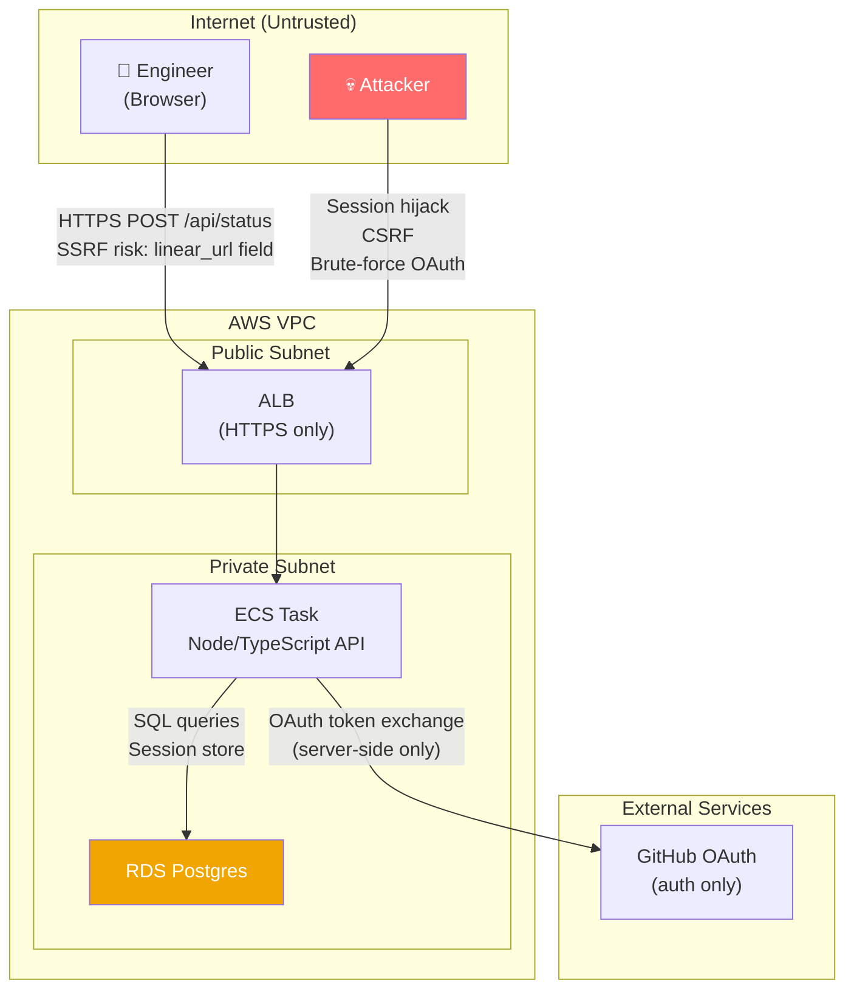

# Architecture

## Nouns and Verbs

**Nouns:** `User`, `StatusEntry`, `Area`

**Verbs:** post (create a new StatusEntry), update (edit the current StatusEntry in-place), view (read the dashboard), filter (by Area), drill-down (read a User's history)

The distinction between *post* and *update* matters: posting creates a new row (you moved on to something new); updating edits the current row (you're refining an entry you already started). This keeps history clean and staleness semantics simple.

## Components

### React SPA
Single-page app served as static assets from the Node server. One main view (the dashboard), one drill-down view (person detail), one form (status update). No complex state management needed — React Query for data fetching is sufficient.

### Node/TypeScript API Server
Express (or Fastify) server that:
- Serves the compiled React build from `/`
- Handles GitHub OAuth flow (`/auth/github`, `/auth/callback`)
- Exposes the REST API under `/api`
- Manages sessions (cookie-based with `express-session` + Postgres session store)

Stateless workers are possible but not necessary for 7 users. Single ECS task is fine.

### Postgres on RDS
Single database. Connection pooling via `pg` with a small pool (5 connections is plenty). No ORM needed given the simplicity of the schema — raw SQL or a lightweight query builder like `kysely`.

### GitHub OAuth
Auth-only; no GitHub API calls after login. The OAuth flow retrieves `github_id`, `login`, `name`, `avatar_url` once at login. Membership in the org is the access gate.

## Data Model

```sql
-- Admin-curated codebase areas
CREATE TABLE areas (
  id           SERIAL PRIMARY KEY,
  slug         TEXT NOT NULL UNIQUE,   -- e.g. "auth", "payments"
  label        TEXT NOT NULL,          -- e.g. "Auth", "Payments"
  display_order INT NOT NULL DEFAULT 0,
  created_by   INT REFERENCES users(id),
  created_at   TIMESTAMPTZ NOT NULL DEFAULT now()
);

-- Engineers (populated on first GitHub login)
CREATE TABLE users (
  id           SERIAL PRIMARY KEY,
  github_id    TEXT NOT NULL UNIQUE,
  github_login TEXT NOT NULL,
  name         TEXT NOT NULL,
  avatar_url   TEXT,
  role         TEXT NOT NULL DEFAULT 'member', -- 'member' | 'admin'
  created_at   TIMESTAMPTZ NOT NULL DEFAULT now()
);

-- Status entries — one per task; current = most recent row per user
CREATE TABLE status_entries (
  id            SERIAL PRIMARY KEY,
  user_id       INT NOT NULL REFERENCES users(id),
  area_id       INT NOT NULL REFERENCES areas(id),
  description   TEXT NOT NULL,           -- what I'm working on, ~500 chars
  status        TEXT NOT NULL,           -- 'in_progress' | 'blocked' | 'done'
  blocking_note TEXT,                    -- nullable; shown when blocked
  linear_url    TEXT,                    -- nullable; optional ticket link
  created_at    TIMESTAMPTZ NOT NULL DEFAULT now(),
  updated_at    TIMESTAMPTZ NOT NULL DEFAULT now()
);

CREATE INDEX ON status_entries (user_id, created_at DESC);
```

**Staleness is computed at query time from `updated_at`** — no background jobs, no stored flags. An edit (description change, status update, blocking note added) resets the clock. Creating a new entry starts a new clock.

**Staleness tiers:**
- `updated_at < now() - interval '24 hours'` AND workday → stale (subtle highlight)
- `status = 'in_progress'` AND `updated_at < now() - interval '3 days'` → stagnant (stronger indicator)

Weekend/holiday awareness: v1 uses calendar time (24h), not business hours. Simple to implement; accepted limitation.

## API

Eight endpoints. All `/api` routes require an authenticated session; admin routes additionally check `role = 'admin'`.

```
GET  /api/me                 Current authenticated user
GET  /api/dashboard          All users with their current entry + staleness flags
GET  /api/users/:id          User's current entry + last 5 status_entries (for drill-down)
POST /api/status             Create new status entry for authed user
PATCH /api/status/current    Edit the authed user's most recent entry in-place
GET  /api/areas              All areas (ordered by display_order)
POST /api/areas              Admin: create area
GET  /api/auth/github        Initiate GitHub OAuth
GET  /api/auth/callback      GitHub OAuth callback → set session → redirect to /
POST /api/auth/logout        Clear session
```

**`GET /api/dashboard` response shape:**
```json
[
  {
    "user": { "id": 1, "name": "Alice", "avatarUrl": "...", "githubLogin": "alice" },
    "entry": {
      "id": 42,
      "area": { "slug": "auth", "label": "Auth" },
      "description": "Refactoring token refresh flow",
      "status": "in_progress",
      "blockingNote": null,
      "linearUrl": "https://linear.app/...",
      "updatedAt": "2026-05-12T09:00:00Z",
      "staleness": "fresh"  // "fresh" | "stale" | "stagnant"
    }
  },
  {
    "user": { "id": 2, "name": "Jamie", ... },
    "entry": null  // no entry yet; shown as "No status posted"
  }
]
```

The `staleness` field is computed server-side. The client doesn't need to know the rules; it just renders based on the value.

**Adjacency detection** is also server-side, in the dashboard query: group entries by `area_id`, flag any area with `count > 1`. The response can include a top-level `adjacencies` field:

```json
{
  "team": [...],
  "adjacencies": [
    { "area": { "slug": "auth", "label": "Auth" }, "userIds": [1, 3] }
  ]
}
```

The frontend uses `adjacencies` to render the overlap badge on affected rows and to warn the user on-post if their selected area has active colleagues.

## Deployment

Standard ECS pattern, consistent with the team's existing services:

```
Internet → ALB (HTTPS) → ECS Service (Node container)
                                  ↓
                           RDS Postgres (private subnet)
```

- **ECS task:** Single container, 256 CPU / 512 MB is more than sufficient for 7 users
- **RDS:** `db.t3.micro`, single-AZ (acceptable for an internal tool)
- **Secrets:** `DATABASE_URL`, `GITHUB_CLIENT_ID`, `GITHUB_CLIENT_SECRET`, `SESSION_SECRET` — stored in AWS Secrets Manager, injected as env vars
- **Sessions:** Stored in Postgres (`connect-pg-simple`); survives container restarts
- **Static assets:** Served directly from Node (no S3/CloudFront needed at this scale)
- **Healthcheck:** `GET /health` → 200

No autoscaling needed. Single task; if it dies, ECS restarts it.

## Cross-Cutting Concerns

**Auth:** GitHub org membership check on first login. On each request, session middleware validates the session cookie. No JWT complexity needed.

**Observability:** Structured JSON logs (via `pino`) to CloudWatch. Log each API request with user ID, route, duration. No metrics infra beyond what ECS/RDS provide natively.

**Error handling:** API errors return `{ error: string }` with appropriate HTTP status. 401 for unauthenticated, 403 for non-admin on admin routes.

## Threat Model



**Top threats:**

| Threat | Severity | Mitigation |
|--------|----------|------------|
| Session hijacking | Medium | HTTPS-only, `HttpOnly` + `Secure` + `SameSite=Strict` cookies |
| SSRF via `linear_url` | Low | Validate URL is `https://linear.app/...` on write; never fetch it server-side |
| CSRF on state-mutating endpoints | Medium | `SameSite=Strict` cookie + CSRF token on POST/PATCH |
| Unauthorized access (non-org member) | Medium | Verify GitHub org membership on OAuth callback |
| Privilege escalation to admin | Low | Role check middleware on all admin routes; role stored in DB, not session |
| Data integrity (someone posting as another user) | Low | `user_id` always set from session, never from request body |
